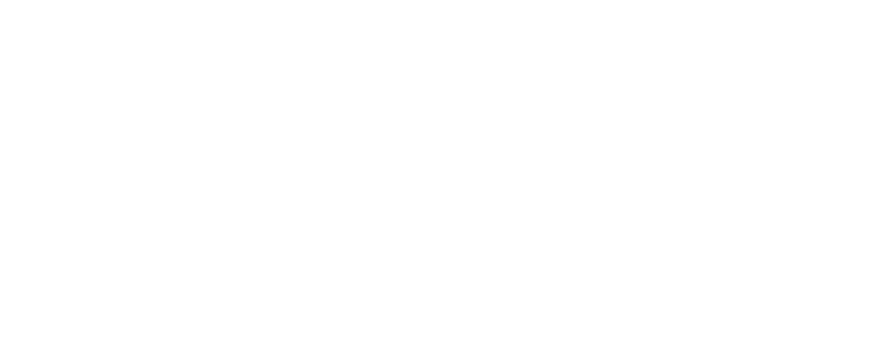

<p align="right">
  
<em>“The sky above the port was the colour of television, tuned to a dead channel.”<br><a href="https://en.wikipedia.org/wiki/Neuromancer">William Gibson</a>, <b><blink>1984</blink></b></em>
</p>  
    


<!--
**makramjandar/makramjandar** is a ✨ _special_ ✨ repository because its `README.md` (this file) appears on your GitHub profile.
<sup><sub>“If you can feel that staying human is worth while, even when it can't have any result whatever, you've beaten them.” George Orwell, <blink><b>1984</b></blink></sup></sub>


Here are some ideas to get you started:

- 🔭 I’m currently working on ...
- 🌱 I’m currently learning ...
- 👯 I’m looking to collaborate on ...
- 🤔 I’m looking for help with ...
- 💬 Ask me about ...
- 📫 How to reach me: ...
- 😄 Pronouns: ...
- ⚡ Fun fact: ...

```Leet
Geek 15 4 mindset,  
Cyberpunk 15 7h47 0f Soul...   
0f 4 world  w17h0u7 limits 02 boundaries !!  
50m3 call 17 UTOPIA, 1 myself call 17 REALITY.
```

> “Tell me how you read and I'll tell you who you are.”
### My All-Time Favourite SF Books
- Neuromancer - William Gibson
- The Quantum Thief - Hannu Rajaniemi
- 
-->
